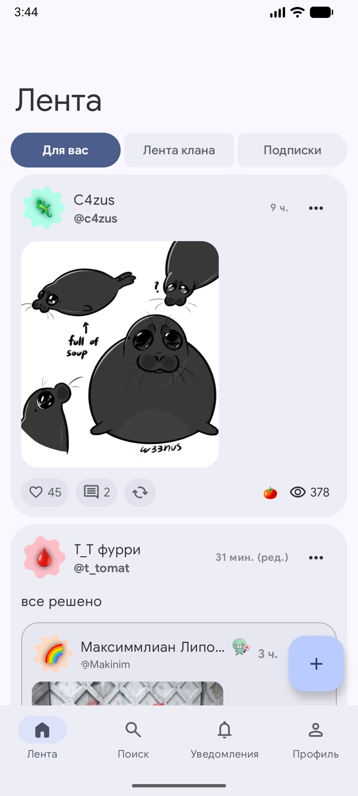
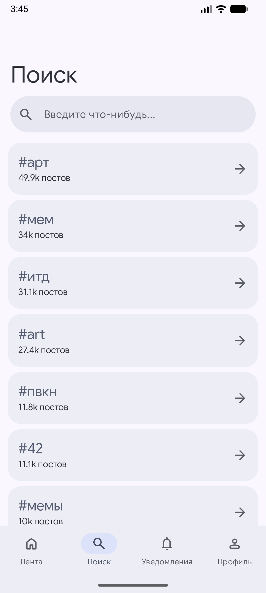
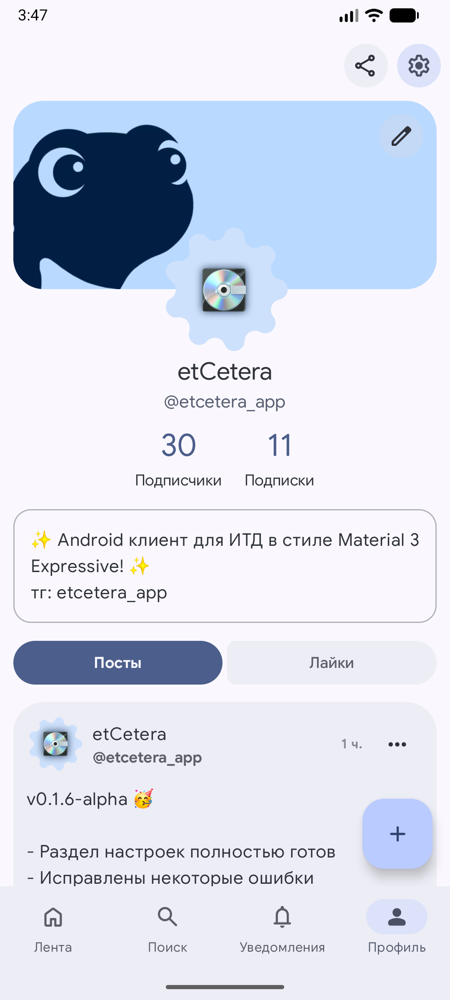
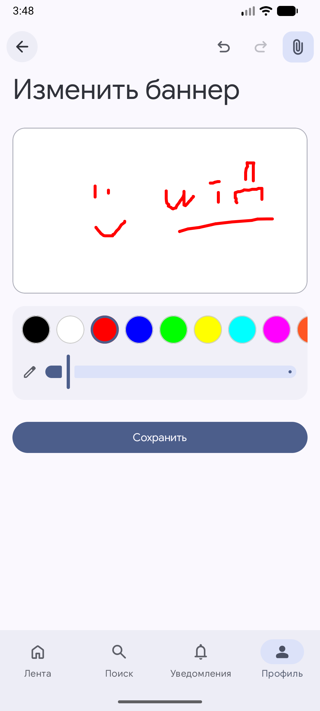
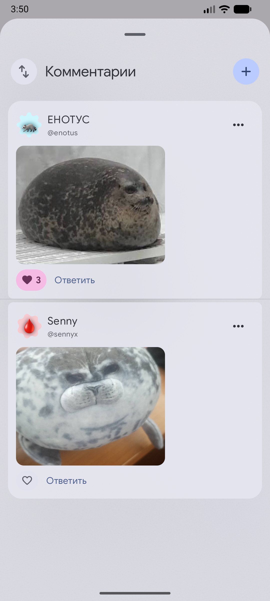
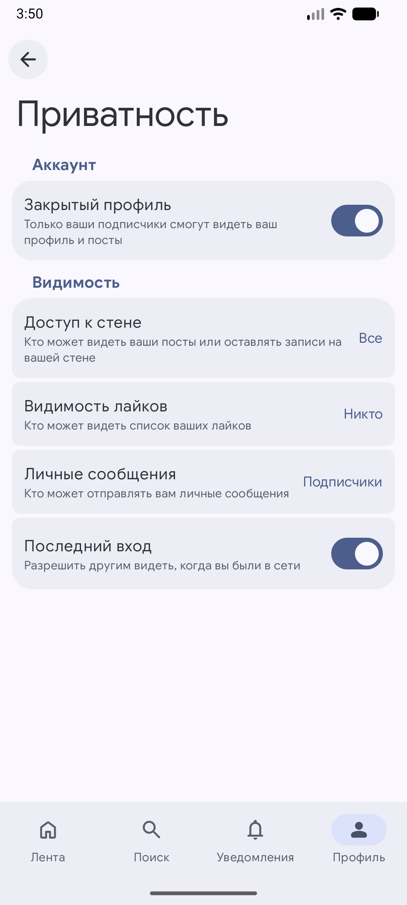
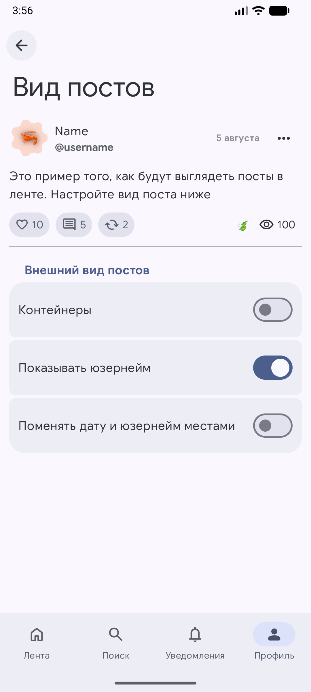
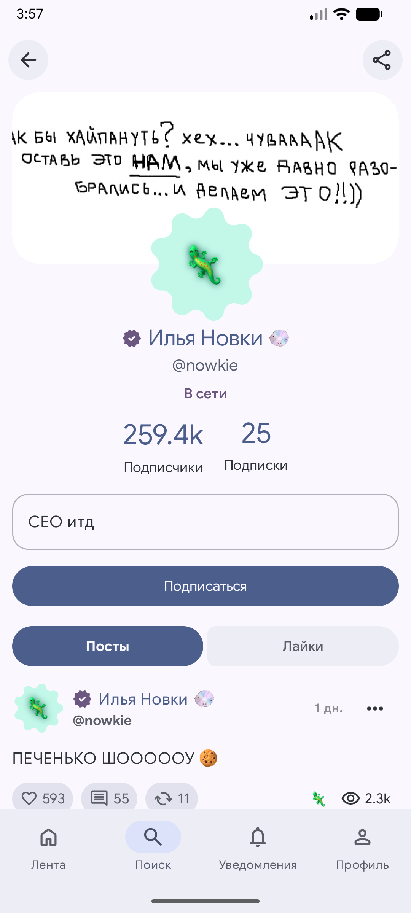
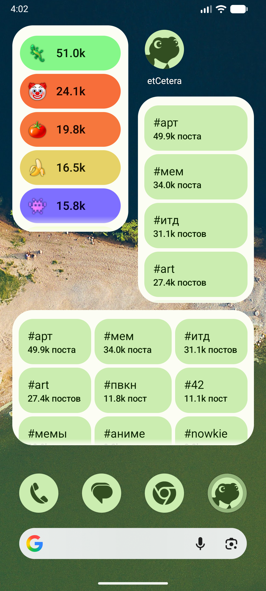
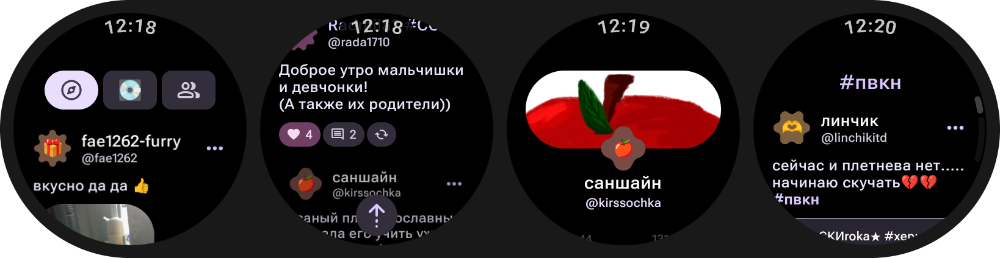

# etCetera

  
<a href="https://play.google.com/store/apps/details?id=com.dertefter.etcetera"></a>

<a href="README.md">
  
</a>
<a href="https://t.me/etcetera_app">
  
</a>

Hello, my dear friend! etCetera is an alternative Android client for the [itd](https://итд.com/) social network designed in the Material 3 Expressive style.

> [!WARNING]
> The etCetera project is not affiliated with the creators of itd in any way and is developed by the community. The app is in active development and may be unstable. Do not use this app if you do not trust it or its creators.
> The authors of the project take no responsibility for any potential issues caused by the etCetera application.

## Some of what's available now:
- Authentication
- Feed: subscriptions, clans, popular
- Posts: likes, comments, reposts, attachments
- "Notifications" section (push notifications are not available yet)
- Search: users, hashtags
- Profile: banner editor, bio, likes, following/followers
- User profiles
- Publishing posts and comments
- Settings: privacy, security
- WearOS app
- Widgets: popular clans, hashtags
- ...


## Screenshots

<div align="center">

<picture>
  <source media="(prefers-color-scheme: dark)" srcset="art/s1_dark.png">
  
</picture>

<picture>
  <source media="(prefers-color-scheme: dark)" srcset="art/s2_dark.png">
  
</picture>

<picture>
  <source media="(prefers-color-scheme: dark)" srcset="art/s3_dark.png">
  
</picture>

<picture>
  <source media="(prefers-color-scheme: dark)" srcset="art/s4_dark.png">
  
</picture>

<picture>
  <source media="(prefers-color-scheme: dark)" srcset="art/s5_dark.png">
  
</picture>

<picture>
  <source media="(prefers-color-scheme: dark)" srcset="art/s6_dark.png">
  
</picture>

<picture>
  <source media="(prefers-color-scheme: dark)" srcset="art/s7_dark.png">
  
</picture>

<picture>
  <source media="(prefers-color-scheme: dark)" srcset="art/s8_dark.png">
  
</picture>

<picture>
  <source media="(prefers-color-scheme: dark)" srcset="art/s9_dark.png">
  
</picture>

<picture>
  
</picture>

</div>

## Building from Source

You will need:
- **JDK 21**
- **Android SDK 37** (API level 37)
1. Clone the repository:
   ```bash
   git clone https://github.com/dertefter/etCeteraApp.git
   cd etCeteraApp
   ```

2. Build via command line:
    ```bash
    ./gradlew :app_mobile:assembleRelease
    ./gradlew :app_wearable:assembleRelease
    ```   
    Or use Android Studio.
    
    Built APK files can be found in the following directories:
    `app_mobile/build/outputs/apk/` and `app_wearable/build/outputs/apk/`.


## License
[Apache License 2.0](LICENSE).
