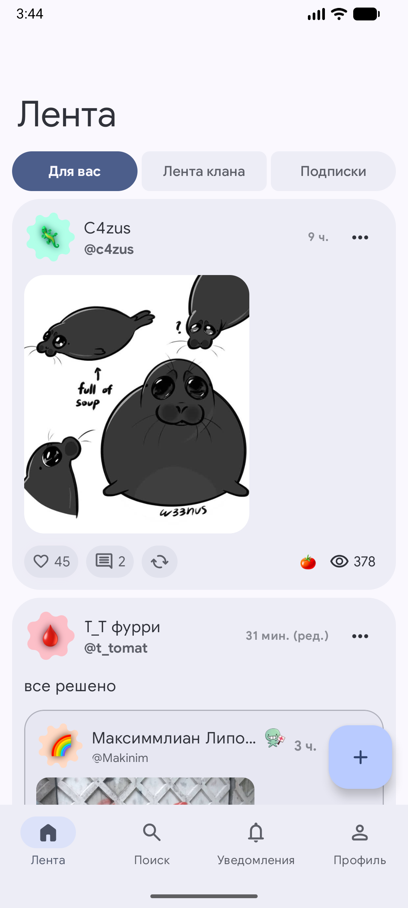
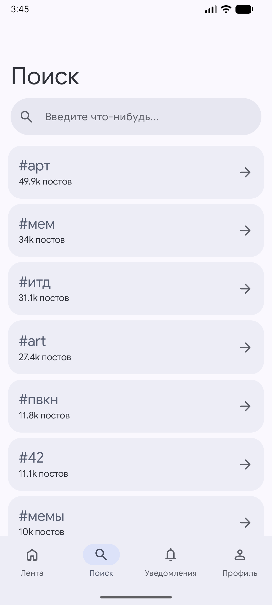
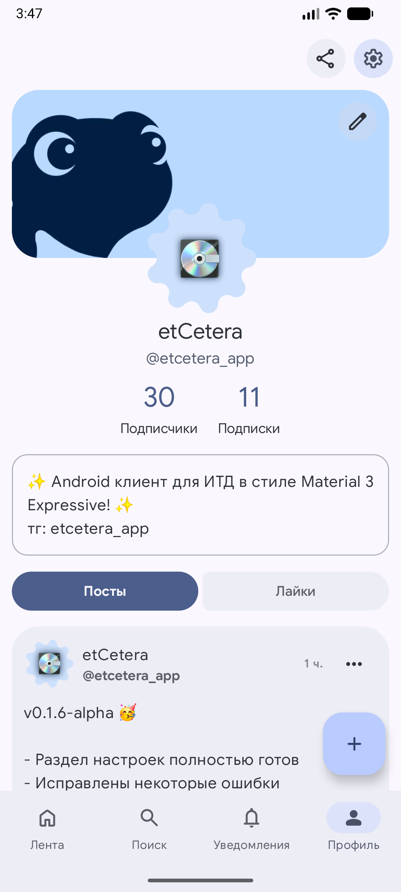
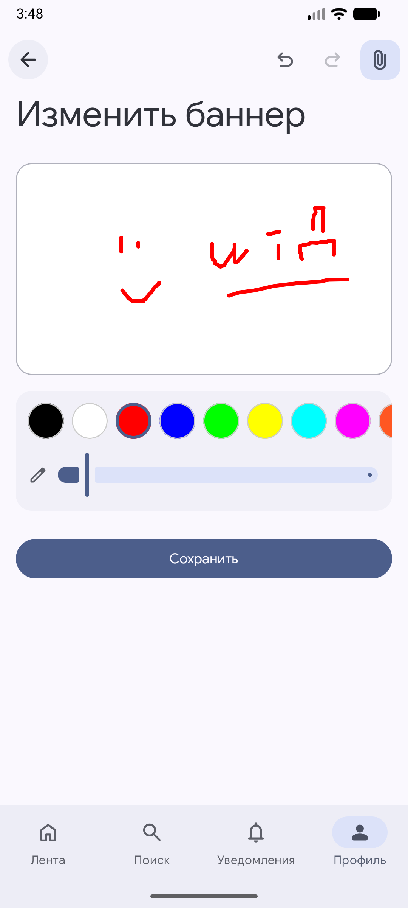
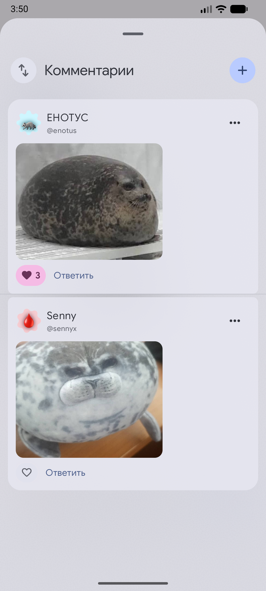
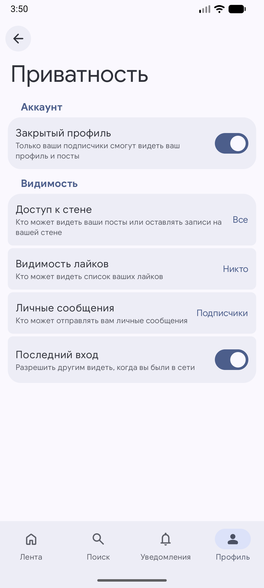
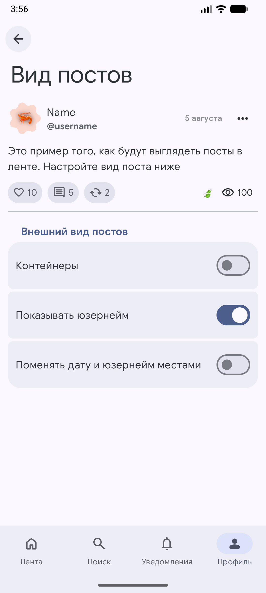
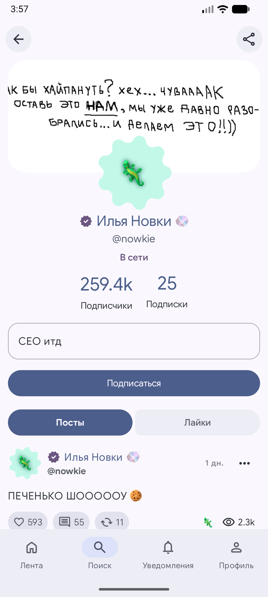
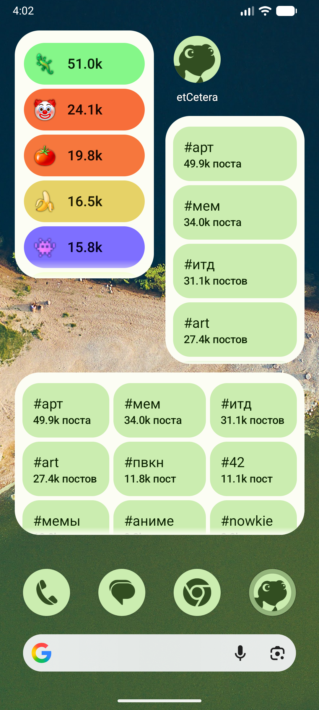

# etCetera

Привет, мой дорогой друг! etCetera – это альтернативный Android-клиент для социальной сети [итд](https://итд.com/) в стиле Material 3 Expressive.

> [!WARNING]
> Проект etCetera никак не связан с создателями итд и развивается сообществом. Приложение находится в активной разработке и может работать нестабильно. Не используйте это приложение, если не доверяете ему или его создателям.
> Авторы проекта не несут ответственности за возможные проблемы, вызванные приложением etCetera.

### Некоторое из того, что готово сейчас:
- Авторизация
- Лента: подписки, кланы, популярное
- Посты: лайки, комментарии, репосты, вложения
- Раздел "Уведомления" (push пока нет)
- Поиск: пользователи, хештеги
- Профиль: редактор баннера, био, лайки, подписки/подписчики
- Профили пользователей
- Публикация постов, комментариев
- Настройки: приватность, безопасность
- Дополнение для WearOS
- Виджеты: популярные кланы, хештеги
- ...


### Скриншоты

<div align="center">

<h1><a id="screenshots"></a>Screenshots</h1>

<picture>
  <source media="(prefers-color-scheme: dark)" srcset="art/s1_dark.png">
  
</picture>

<picture>
  <source media="(prefers-color-scheme: dark)" srcset="art/s2_dark.png">
  
</picture>

<picture>
  <source media="(prefers-color-scheme: dark)" srcset="art/s3_dark.png">
  
</picture>

<picture>
  <source media="(prefers-color-scheme: dark)" srcset="art/s4_dark.png">
  
</picture>

<picture>
  <source media="(prefers-color-scheme: dark)" srcset="art/s5_dark.png">
  
</picture>

<picture>
  <source media="(prefers-color-scheme: dark)" srcset="art/s6_dark.png">
  
</picture>

<picture>
  <source media="(prefers-color-scheme: dark)" srcset="art/s7_dark.png">
  
</picture>

<picture>
  <source media="(prefers-color-scheme: dark)" srcset="art/s8_dark.png">
  
</picture>

<picture>
  <source media="(prefers-color-scheme: dark)" srcset="art/s9_dark.png">
  
</picture>

</div>

### Сборка из исходников

Вам понадобятся:
- **JDK 21**
- **Android SDK 37** (API level 37)
1. Клонируйте репозиторий:
   ```bash
   git clone https://github.com/dertefter/etCeteraApp.git
   cd etCeteraApp
   ```

2. Сборка через командную строку:
    ```bash
    ./gradlew :app_mobile:assembleRelease
    ./gradlew :app_wearable:assembleRelease
    ```   
    Или используйте Android Studio.
    
    Готовые APK-файлы можно найти в директориях
    `app_mobile/build/outputs/apk/` и `app_wearable/build/outputs/apk/`.


### Лицензия
[Apache License 2.0](LICENSE).
